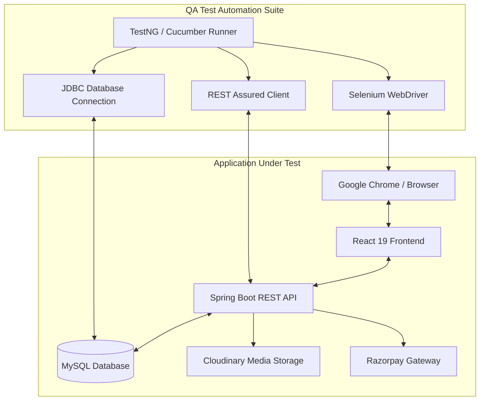
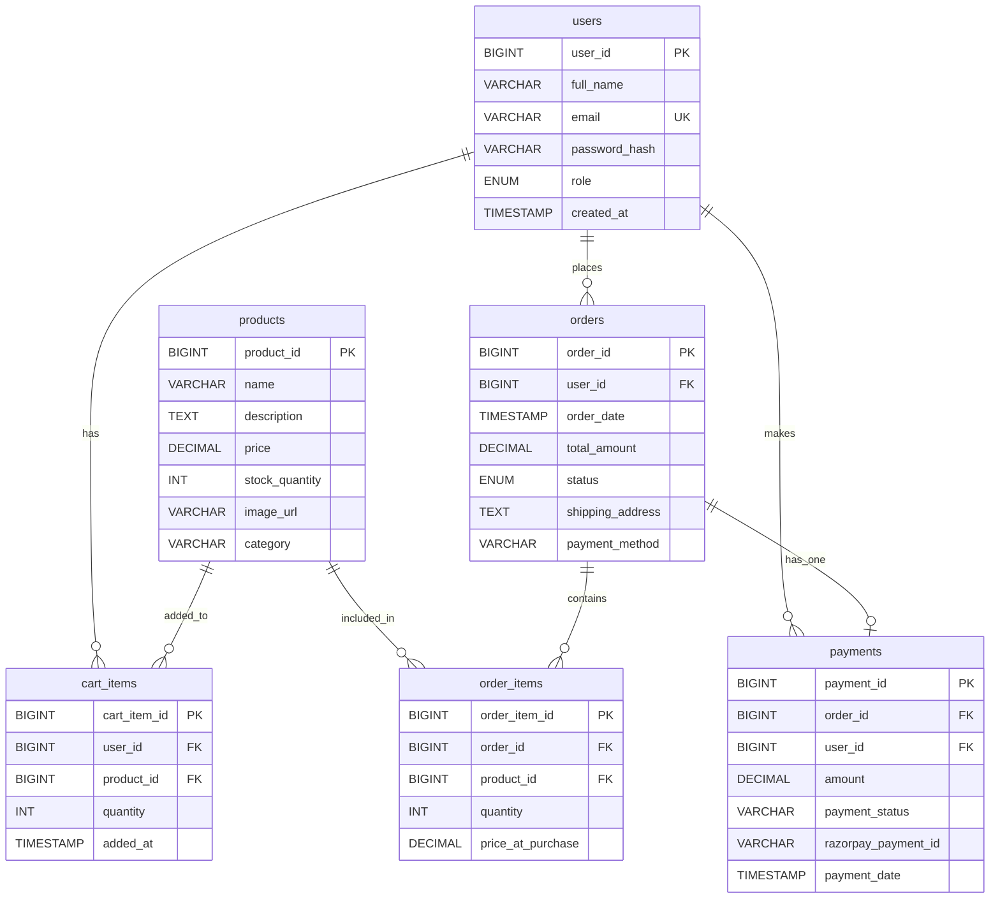

# 🛒 EcoMart: Full-Stack E-Commerce & QA Automation Suite

[](https://www.oracle.com/java/)
[](https://spring.io/projects/spring-boot)
[](https://react.dev/)
[](https://www.mysql.com/)
[](https://www.selenium.dev/)
[](https://cucumber.io/)
[](https://rest-assured.io/)

---

## 🌟 Executive Summary

**EcoMart** is a comprehensive, production-grade project showcasing a modern, full-stack e-commerce marketplace coupled with a **multi-layered, enterprise-grade test automation framework**. 

While the application itself is built with a decoupled architecture—featuring a **React** client, **Spring Boot** REST API backend, and **MySQL** database—the crown jewel of this repository is the **Automation Test Suite**. Developed in Java using a **BDD Cucumber + Selenium WebDriver + TestNG** setup, the testing framework validates the integrity of the platform across three core layers:
1. **User Interface (UI)**: Selenium Webdriver validating real-world browser scenarios and viewport responsiveness.
2. **REST API**: REST Assured executing request-response validation, status code verification, and schema testing.
3. **Database (DB)**: Direct JDBC-driven validation verifying MySQL schema integrity, unique constraints, and ACID compliance post-UI operations.

This repository serves as a prime portfolio piece illustrating how to design, seed, build, protect, and thoroughly test a complex web ecosystem.

---

## 🏗️ System & Test Architecture

The following architecture diagram displays how the **EcoMart QA Framework** is integrated with the web application to perform E2E verification across all interfaces:



---

## 🛡️ QA Automation Capabilities (Main Focus)

The automated test framework is located under [/selenium-tests](file:///G:/ecommerce-app-main/selenium-tests) and is organized using the **Page Object Model (POM)** and **BDD Cucumber Feature Files**.

### 1. UI Test Automation (Selenium WebDriver & POM)
- **Design Pattern**: Complete Page Object Model separation for maintainability and code reusability. Page classes encapsulate page-specific behaviors (e.g., login, registration, cart operations, checking out).
- **Responsive Layout Verification**: Automated tests resize viewports dynamically to verify that key elements (e.g., Navigation menus, CTA buttons) remain visible and accessible on mobile, tablet, and desktop views ([responsiveUi.feature](file:///G:/ecommerce-app-main/selenium-tests/src/test/resources/features/responsiveUi.feature)).
- **Explicit Waits & Synchronization**: Built-in mechanisms to handle asynchronous operations, loaders, and API response latencies, eliminating flaky test runs.

### 2. Service & API Testing (REST Assured)
- Located under `api` package ([api directory](file:///G:/ecommerce-app-main/selenium-tests/src/test/java/api)).
- Validates the functional endpoints of the REST API (Auth, Profile, Cart, and Products).
- Inspects status codes, response headers, payload structures, JSON data validations, and authorization-headers validation.

### 3. Direct Database Verification (JDBC & MySQL)
- Evaluates persistence logic directly by querying the MySQL database using standard JDBC ([DatabaseSteps.java](file:///G:/ecommerce-app-main/selenium-tests/src/test/java/stepdefinitions/DatabaseSteps.java)).
- **Constraint Testing**: Verifies that database-level constraints (e.g., unique email constraints, unique phone constraints, and foreign keys) reject invalid inserts with SQL Exceptions.
- **Transactional State Verification**: Verifies that when a product is added to the cart on the UI, it is successfully written to the DB.
- **Inventory Verification**: Confirms that completing an order on the UI correctly decrements the product stock in the database.
- **Isolated Testing Practices**: Automatic clean-up routines wipe out test accounts, addresses, and order histories created during BDD scenarios to ensure database hygiene.

### 4. Security & Access Control Tests
- **JWT Checks**: Verifies that protected API resources reject expired, modified, or missing JSON Web Tokens with a `401 Unauthorized` or `403 Forbidden` response.
- **Authentication Bypass**: Automated tests check if standard customers can access admin endpoints or if unauthenticated clients can inspect user profiles ([securityEdgeCases.feature](file:///G:/ecommerce-app-main/selenium-tests/src/test/resources/features/securityEdgeCases.feature)).
- **Input Sanitization**: Confirms validation behaviors against SQL injection vectors and empty inputs.

---

## 📊 Comprehensive Test Case Coverage (Manual & Automated)

The project includes **110+ detailed test cases** covering Authentication, User Profile, Address Management, Checkout flows, and Security rules. 

These test cases are maintained in two formats:
1. 📂 **Excel Spreadsheet (Manual Test Suite)**: Contains complete functional test metadata ([Manual TCS.xlsx](file:///G:/ecommerce-app-main/selenium-tests/Manual%20TCS.xlsx)).
2. 📄 **CSV Format (GitHub Rendered)**: Located in the root directory ([login_profile_test_cases.csv](file:///G:/ecommerce-app-main/login_profile_test_cases.csv)). 
   > [!TIP]
   > GitHub natively renders `.csv` files as beautiful, search-enabled interactive tables. Simply click the link to view the complete list online.

### 📋 Manual Test Case Preview (Sample Cases)

Below is a preview of the manual test cases from the suite:

| Test Case ID | Module | Title | Actions | Expected Results |
| :--- | :--- | :--- | :--- | :--- |
| **TC-01-01** | Authentication | New User Registration | 1. Go to signup form<br>2. Fill details (name, email, phone, gender)<br>3. Submit | Successful registration toast, redirected to Login screen. |
| **TC-01-02** | Authentication | Registration Validation Errors | 1. Submit empty form<br>2. Submit invalid phone/password format | Respective toast validation alerts appear on screen. |
| **TC-02-03** | User Profile | Address with Geolocation | 1. Click "Use My Current Location"<br>2. Populate address details and save | Geolocation automatically fills City, State, Pincode. Address card saved. |
| **TC-02-05** | User Profile | Initiate Email Verification | 1. Click "Send email OTP" on profile | Verification status shows unverified, OTP is triggered and input box displays. |
| **TC-02-09** | User Profile | Change Password Flow | 1. Enter correct current password<br>2. Enter new password and save | Password updated successfully toast. Previous session terminated. |

The Cucumber automated BDD suite maps these manual cases to automated UI, API, and DB assertions. Highlights from the [Cucumber Features](file:///G:/ecommerce-app-main/selenium-tests/src/test/resources/features) include:
* **`databaseTesting.feature`**: Direct validation of constraints, stock decrements, and cart synchronization.
* **`securityEdgeCases.feature`**: Checks JWT token expiration and user authentication boundaries.
* **`orderStateTransition.feature`**: Asserts state tracking from "PENDING" to completion.
* **`responsiveUi.feature`**: Resizes window to check responsive UI elements.

---

## 🗄️ Database Entity Relationship (ER) Diagram

Below is the entity-relationship schema that coordinates the application's domain objects and is validated directly by our database automation tests:



---

## ⚙️ Getting Started & Setup

### 📋 Prerequisites
Ensure you have the following installed on your machine:
- **Java JDK 17** or higher
- **Node.js (v18+)** & **npm**
- **MySQL Server 8.0**
- **Maven** (or use the provided wrapper scripts `./mvnw`)
- **Google Chrome** (Selenium WebDriver is configured to use WebDriverManager to load Chrome automatically)

---

### 1. Database Setup
1. Log in to your MySQL command line or client:
   ```sql
   CREATE DATABASE ecommerce;
   ```
2. Configure credentials:
   Create a `.env` file under the `/backend` folder. Copy values from [backend/README.md](file:///G:/ecommerce-app-main/backend/README.md) and update your database username and password:
   ```env
   DB_URL=jdbc:mysql://localhost:3306/ecommerce
   DB_USERNAME=root
   DB_PASSWORD=your_mysql_password
   JWT_SECRET=your_jwt_secret
   ```

---

### 2. Start the Backend API
1. Navigate to the backend directory:
   ```bash
   cd backend
   ```
2. Run the application using Maven:
   ```bash
   mvn spring-boot:run
   ```
   The backend API will start running at `http://localhost:8080`.

---

### 3. Start the Frontend Application
1. Navigate to the frontend directory:
   ```bash
   cd frontend
   ```
2. Install dependencies:
   ```bash
   npm install
   ```
3. Run the development server:
   ```bash
   npm start
   ```
   The React client will launch at `http://localhost:3000`.

---

### 4. Run the Automated Test Suite
The QA framework is configured to run tests against the running local instance of the application. Ensure the backend and frontend are running before launching tests.

1. Navigate to the test automation directory:
   ```bash
   cd selenium-tests
   ```
2. Configure the database credentials and endpoints in the test properties file:
   File: [selenium-tests/src/test/resources/config.properties](file:///G:/ecommerce-app-main/selenium-tests/src/test/resources/config.properties)
   ```properties
   baseUrl=http://localhost:3000/ecommerce-app
   dbUrl=jdbc:mysql://localhost:3306/ecommerce
   dbUsername=root
   dbPassword=your_mysql_password
   ```
3. Execute the full test suite (E2E UI & REST API Tests) via Maven:
   ```bash
   mvn clean test
   ```
4. Run only API integration tests:
   ```bash
   mvn test -DsuiteXmlFile=src/test/resources/testng-api.xml
   ```
5. Run specific BDD features using Cucumber tags:
   You can specify tags in your Cucumber runner class or execute Maven profiles to target specific test areas like `@Database`, `@Security`, or `@Responsive`.

---

## 🛠️ App Core Technologies

### Backend API
- **Spring Boot 3.2.5**: Core framework.
- **Spring Security & JWT**: Standard auth and access control validation.
- **Spring Data JPA & Hibernate**: Entity mapping and persistence.
- **Cloudinary SDK**: Remote image upload hosting for profile images and products.
- **Razorpay**: E-Commerce checkout payment workflows.
- **Springdoc OpenAPI**: Automatic swagger documentation generation.

### Frontend Client
- **React 19**: Component structure.
- **Tailwind CSS**: Utility-first premium styling.
- **Axios**: HTTP communication.
- **React Router**: Client-side navigation routing.

---

## 📁 Repository Directory Structure

```text
├── backend/                       # Spring Boot Application REST API
│   ├── src/                       # Java source code & properties
│   ├── pom.xml                    # Maven dependencies configuration
│   └── README.md                  # Backend implementation notes
│
├── frontend/                      # React SPA Web Client
│   ├── src/                       # Components, routes, and styling
│   ├── package.json               # Node modules & script scripts
│   └── README.md                  # Frontend development notes
│
├── selenium-tests/                # QA Automation Framework
│   ├── src/test/java/
│   │   ├── api/                   # REST Assured API integration tests
│   │   ├── stepdefinitions/       # Cucumber steps (UI, DB, Auth)
│   │   ├── tests/                 # TestNG UI test scripts
│   │   └── runners/               # Cucumber test runner
│   ├── src/test/resources/
│   │   ├── features/              # Cucumber Gherkin feature files
│   │   ├── config.properties      # Test environments configuration
│   │   └── testng.xml             # Test suite execution mapping
│   └── pom.xml                    # Test dependencies (Selenium, TestNG, etc.)
│
├── login_profile_test_cases.csv   # Documented 110 Test Cases CSV
└── README.md                      # Primary Root Readme (This document)
```
